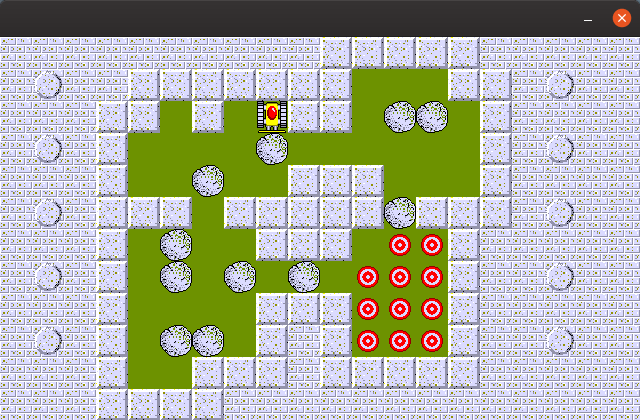

# Bulldozer game in C
This is the famous puzzle retro videogame, developed in the 90's about pushing rocks onto targets.

  

I developed a version in C using the SDL graphic library.

## Demo

[Youtube Video](https://www.youtube.com/watch?v=QQdxiQNExBM&t=1s "Youtube Video")

This is meant to be an educational project to learn about the use of the SDL graphic library.

>     Make sure you have already installed SDL 1.2 library on your PC to compile it! 

__________________

## Overview

The game has ALL 60 levels.

First we have a level selector:

  

MAP 1 | MAP 2 | MAP 3
------------ | ------------- | -------------
 |  | 

### Controls

